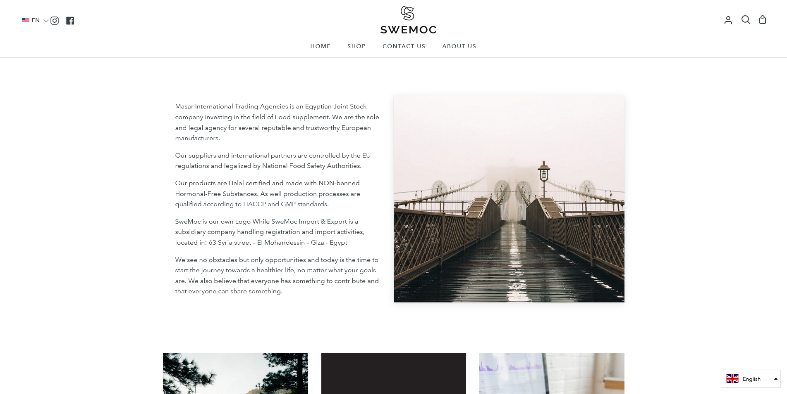
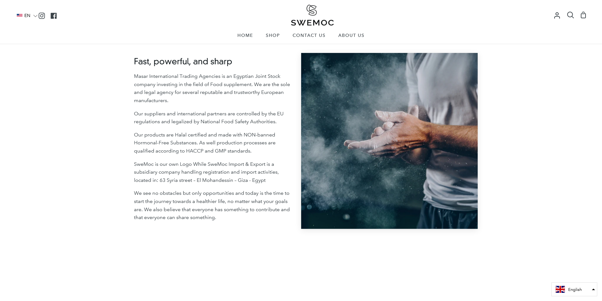
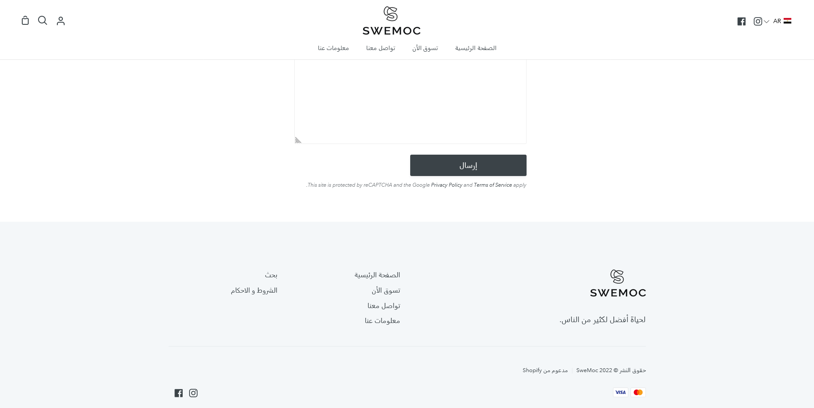
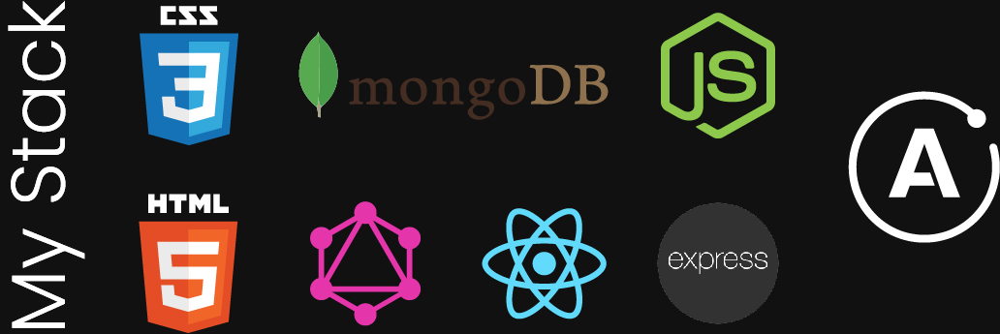

### Visit the website here: [SweMoc's website](https://swemoc.com)

I had already worked with SweMoc on a landing site, but their business needed time to get their papers ready and start selling. The E-commerce platform wanted to distinguish themselves from their competitors.

# Here are some of the features they wanted:

•360 degree view images

•ERP integration

•Paymob integration

•facebook/google login

•Arabic content

•terms and conditions

•FAQ

•Design social buttons

•Reviews

•location on shipping cart

I worked together with their content team which helped a lot.

