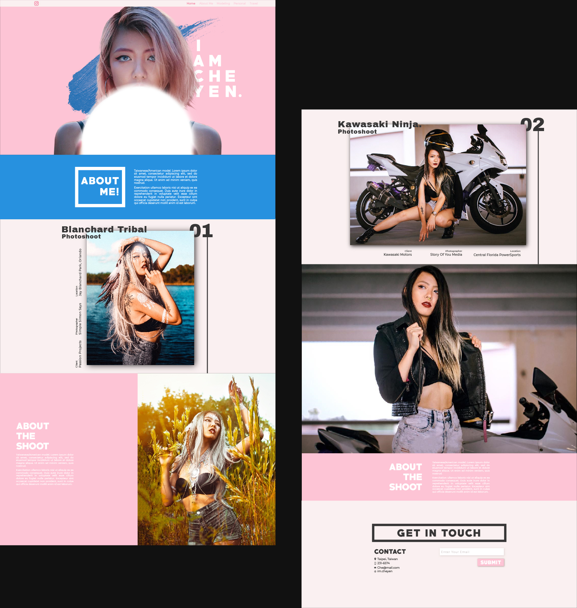
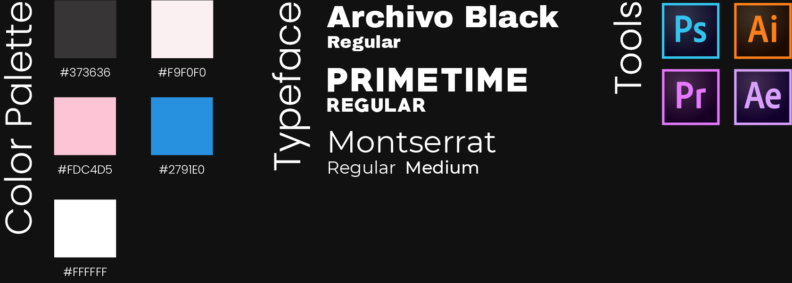

### Goal/Objective

Che is an American-Taiwanese model, she wanted an alternative way to display her modeling shoots and personal life. She wanted to customize how she presents her work in a way that reflected the brand she wanted to create. So I needed to create a simple but unique design and vibe that would be associated with Che.

### Thought process/Wireframing

I spoke with Che to see what kind of content she wants to post on her website. After talking about it for a while, we categorized the content into 3 types, modeling shoots, travel photos, and personal photos.

My general approach was to create something image-based and aesthetically pleasing. I started wireframing with that in mind, I had images taking up the most space but large enough to be viewed in a single screen and not bleeding out at the top and bottom where you'd have to scroll to see the rest of the image (I always found that annoying). Since she wanted to present her photos in gallery shoots, I made 1 "cover photo" for the photo shoot and then beneath it a carousel with the remaining photos in the shoot.

### Final Design

After I finished wireframing the homepage and the 3 tabs, I began designing the website. Since I wanted the website to be image-based, I began designing for PC and Laptop screens first, then created a mobile adaptive design. I choose a feminine color palette and bold fonts for the primary text and a clean san-serif font for the secondary text giving the website a modern look.

# Watch the video:

`youtube:https://www.youtube.com/embed/laBjlkwhcGo`

