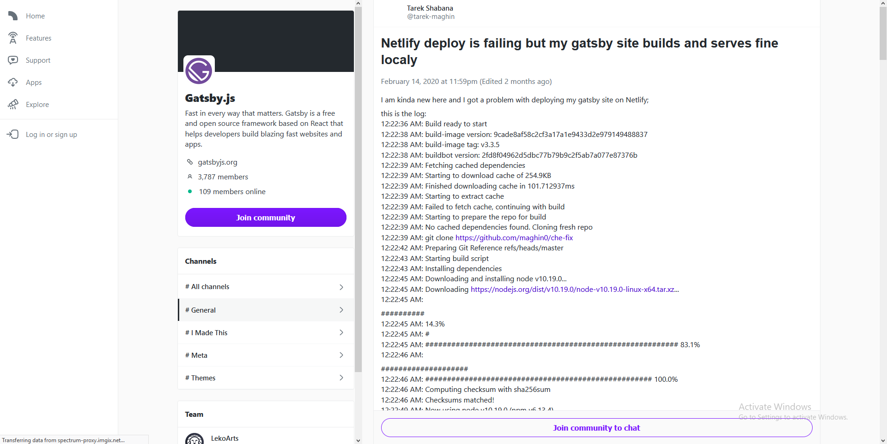

### Visit the website here: [Che Yen's website](https://che-san.netlify.com)

# The Design

### Goal/Objective

Che is an American-Taiwanese model, she wanted an alternative way to display her modeling shoots and personal life. She wanted to customize how she presents her work in a way that reflected the brand she wanted to create. So I needed to create a simple but unique design and vibe that would be associated with Che.

### Thought process/Wireframing

I spoke with Che to see what kind of content she wants to post on her website. After talking about it for a while, we categorized the content into 3 types, modeling shoots, travel photos, and personal photos.

My general approach was to create something image-based and aesthetically pleasing. I started wireframing with that in mind, I had images taking up the most space but large enough to be viewed in a single screen and not bleeding out at the top and bottom where you'd have to scroll to see the rest of the image (I always found that annoying). Since she wanted to present her photos in gallery shoots, I made 1 "cover photo" for the photo shoot and then beneath it a carousel with the remaining photos in the shoot.

### Final Design

After I finished wireframing the homepage and the 3 tabs, I began designing the website. Since I wanted the website to be image-based, I began designing for PC and Laptop screens first, then created a mobile adaptive design. I choose a feminine color palette and bold fonts for the primary text and a clean san-serif font for the secondary text giving the website a modern look.

# Watch the video:

`youtube:https://www.youtube.com/watch?v=laBjlkwhcGo`

# The Development

### Stack

JAM stack
Building this project I had to keep in mind the potential goal which was to have an online shop that was going to sell cloths Che’s dream of owning a clothing line so I had a few things in mind:
• SEO (Search Engine Optimization)
• Lead conversion
• Bounce rates
• Team Productivity
• Revenue

### Why I choose to use Gatsbyjs

> -Gatsby is a website development tool for React, the most modern way to build reliable, lightning-fast websites–

I used GatsbyJS for this project as I had been in love with it for the past couple of months learning and building small apps with it. Its simplicity and speed fascinated me! What was really cool was how I could just build and deploy in minutes, thus have it delivered on time.
With a website framework (like Gatsby), the website is pre-built and hosted on the edge before the user even types in a URL. This means that there are no servers involved or delays in loading a webpage. It’s just ready to go. Think of it as going to a conveyor belt sushi bar and having all the delicious sushi just waiting for you. No need to order- just pick what you want and start eating. Conveyor belt sushi for websites!

This makes it so that you have blazing fast page load times. By blazing fast, I mean the pages can load so quickly that it seems instantaneous and on slower connections and mobile phones, the experience is still fast. Fast sites translate into higher revenue (for e-commerce sites), a better user experience, and greater lead conversion. I was on a cross country flight recently and had a poor internet connection. The only websites I could get to load on my computer were Gatsby sites. That gives a company a huge advantage if their site loads on a slow connection when their competitors’ sites don’t. And due to this speed you check a couple of boxes instantaneously SEO (Search Engine Optimization), lead conversion, team productivity, and revenue.

#### Problem Solving Experiences

The Gatsby community is great, I had a problem with my Netlify deploy at first due to a very minute thing that I had no clue about. It was a upper case letter that I had written in the file name that was written in smaller case on the JS file inside my project which was explained to me by Jeremy Albright he really did a great job in replying in under a day. Here is a link to the post if you would like to check that out:
\
https://spectrum.chat/gatsby-js/general/netlify-deploy-is-failing-but-my-gatsby-site-builds-and-serves-fine-localy~2b2ecabe-2221-46cd-b8e4-1f711034a3ab

The next thing that hit me was the images. I didn’t want it to be any slower and I wanted to leverage the full speed of Gatsby so I looked into Gatsby images and found out the many benefits they bring such as resizing images for responsiveness on different devices, lazy-loading, using srcsets and picture tag. I never worked with this technology before I had no idea how to implement this, but I searched, learned and started doing.

Next problem I faced was that I had many single images and carousels that needed to be displayed on 2 components and on three different pages. When I tried to use Gatsby image at first I could only load one image per page or per components that’s mainly due to it not being able to pass down parameters. So I kept looking, when another great community member answered me on Gatsby’s discord channel and told me to look into “fragments” and found that we can use a static query and load images into a GraphQL fragment that would look into my images folder and load all the single images into my components.

