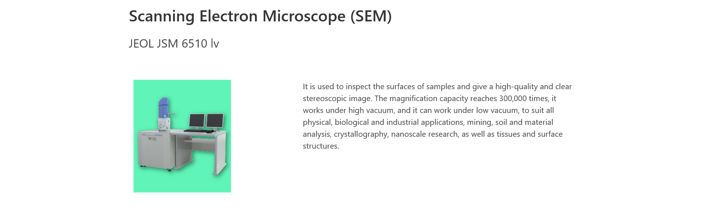
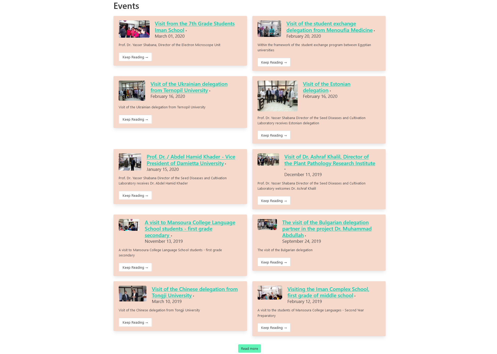

### Visit the website here: [em-unit's website](https://emunit.netlify.app/)

This client wanted a website upgrade from what they had previously.

Which had little to none of the following:

- Image optimization
- Responsiveness
- Lazy loading
- Hydration
- Code splitting
- Webpack configurations

And what is better than a static site when it comes to a simple blog site, so using Gatsby and the power of netlifyCMS.

Not only with all of the features that it did not have listed above but also with the incredible power of being on the edge of the CDN, always ready to be served

This project was self-made to help me understand how to use a stack that I have been always interested in, and that’s the MERN (MongoDB, Express, React, and Nodejs) stack. I also used graphQL and Apollo-client to manage data in the application.

While building this I learned so much about MERN stack but later I found out that Gatsby and the JAM stack are much faster and lighter to build. And that’s when I started learning and building Salon website.

