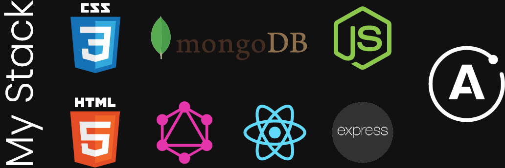

### Visit the website here: [em-unit's website](https://emunit.netlify.app/)

This client wanted a website upgrade from what they had previously.

Which had little to none of the following:

- Image optimization
- Responsiveness
- Lazy loading
- Hydration
- Code splitting
- Webpack configurations

What is better than JAM stack when it comes to a simple blogging website? Nothing, so using power of Gatsby, GraphQL and netlifyCMS to create this website, not only with all of the features that it did not have listed above but also with the incredible power of being on the edge of the CDN, always ready to be served

This project helped me understand the CMS world more than I ever did before. Using headless CMS is very powerful;

- you only need a single source of content
- separated layers of code and content
- API content delivery
- no need for multiple instances to serve different digital channels

