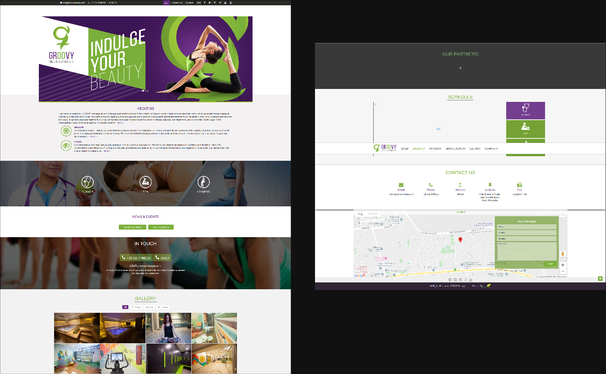
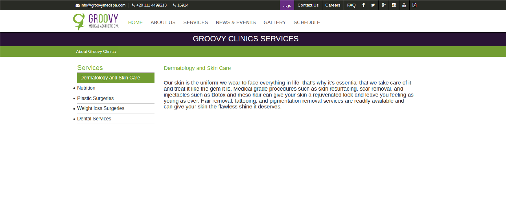
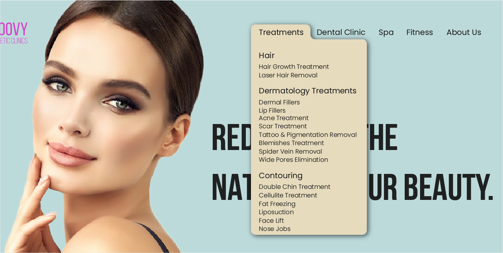
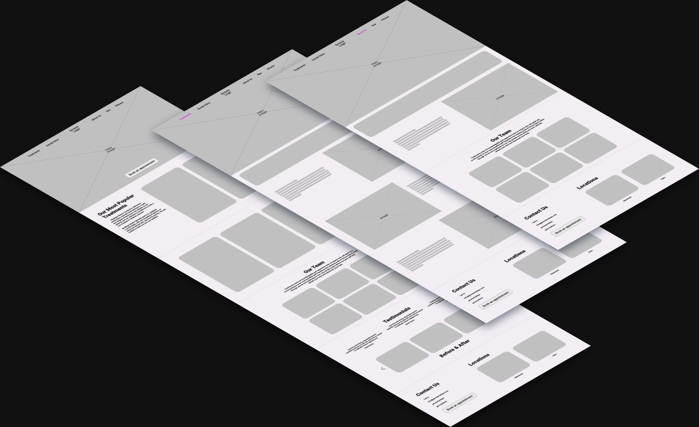
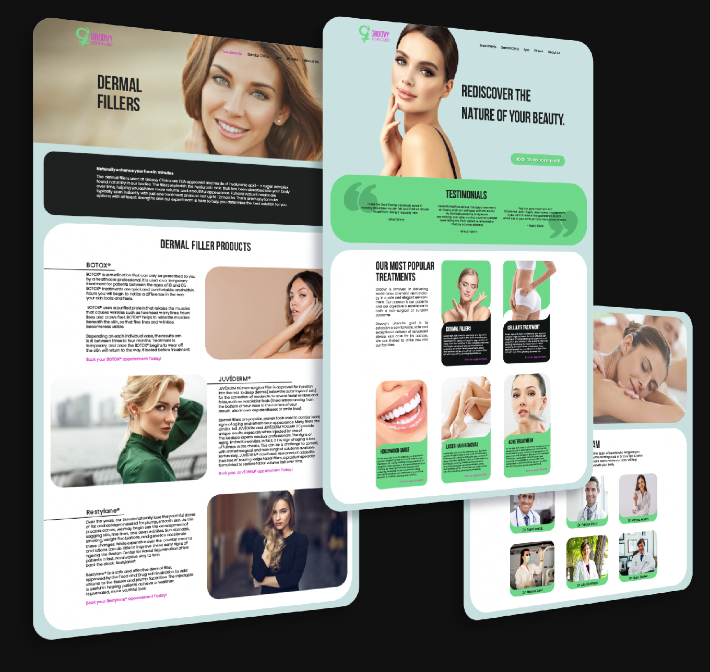
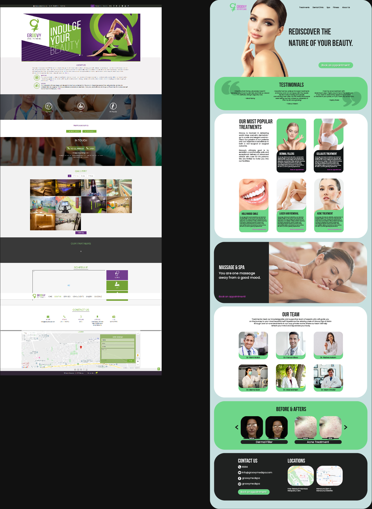
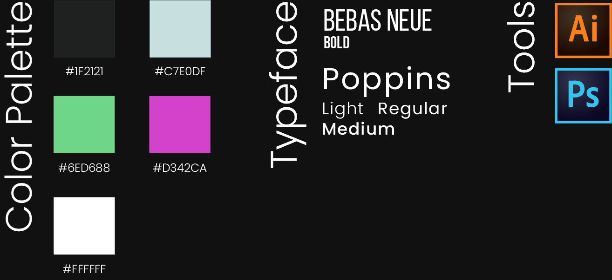

### Goal/Objective

This is an unsolicited redesign I made for Groovy Medspa’s website. Groovy is a medical spa in Egypt with multiple branches in the country. I was really excited about this project because Groovy has beautiful, modern clinics and centers but their website was in dire need of a redesign to match their physical presence. Their website needed a much more user-friendly, customized design to showcase their beauty services and allow customers to book appointments online. My goal was to combine a smooth exploration experience with enhanced brand storytelling to highlight their passion, dedication to quality, and the science behind their products and services.

I strongly believe that the reason a customer is unable to reach a service should never be because the customer couldn’t find the service’s number or location, or their website was too complicated and thus they couldn’t find what they’re looking for, or they wanted to book an appointment online but that option wasn’t available etc. Visitors need to be able to easily search products and services, explore educational resources, and see local results to help them access Groovy services online.

### Problems with their Current Website

The 2 main issues I identified in their current website are poor aesthetics and lack of information. The web design is old-fashioned and the colors are dark and uninviting.

Under each tab there’s only generic information on the products or procedures, there isn’t even a comprehensive list of all the procedures they provide.

### Thought Process & Wireframe : UX & Research

I first began researching all the procedures that Groovy provided for their clients. I reorganized their navigation bar to be more user friendly and easier to understand. I categorized their services to treatments, dental clinic, spa and fitness. Their main services are provided under “treatments” which I organized into hair, dermatology treatments, and contouring. Under each segment I decided to name each treatment with the condition that the client would have and is looking to treat because that’s what the client would be more familiar with rather than the name of the procedure. For example, if someone has acne, they would be looking for “acne treatment” rather than “fractional laser” (which is the name of the procedure itself).

Then I looked at their homepage to see which segments I should leave and which I should change to give a better user experience and conversion. First and most importantly, I added a CTA (book an appointment) above the fold and in multiple places throughout the page so that it’s always easy to book an appointment whenever the client wants to do so. Their services section was definitely essential but it did not include much, so I decided to keep it and expand on it by including their most popular treatments. I also added before & after pictures because I felt they are vital for their credibility. Lastly they had a couple of non-functioning segments that I got rid of and replaced with segments like “Our Team” and “Testimonials.”

### Thought Process & Wireframe: UI

After gathering the content that I’m going to put on the homepage, I like to write it all down on a list to make sure that I include everything in my wireframe. Then I began working on the wireframe and layout, distributing the components in a way that would make each segment and the pages overall well balanced.

### Final Design

The first thing I wanted to change was their color palette. Their colors were dark shades of purple and green, which I thought looked old and lighter tints of these colors would instantly modernize the look of their website. So I began changing their color palette to brighter and more vivid colors. I placed each segment in rounded-corner rectangles, which has been a design trend lately that major websites like Facebook and Google have upgraded to.

