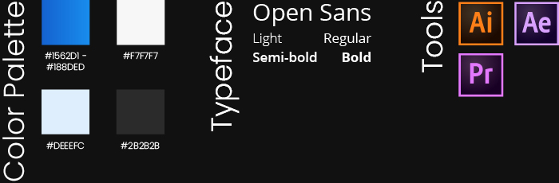

This is one of the first apps I designed. I was trying to go for a very simplified, gesture based music app design. The major feature was the play button, which I illustrated in video to show how it would work. The rest of the design was rather minimal, with as few buttons as possible.

# Watch the video:

`youtube:https://www.youtube.com/embed/yyd0n0cdA7A`

