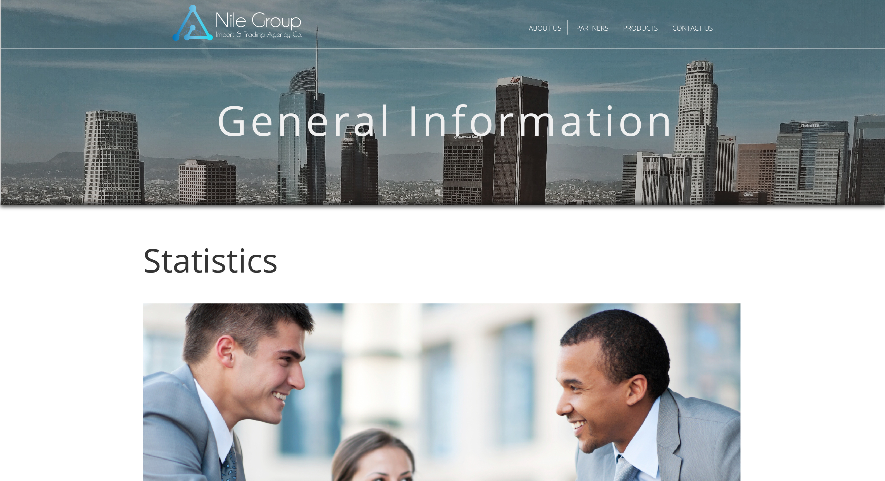
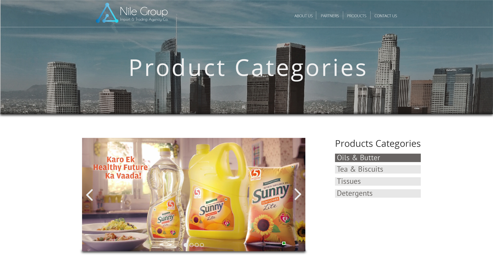
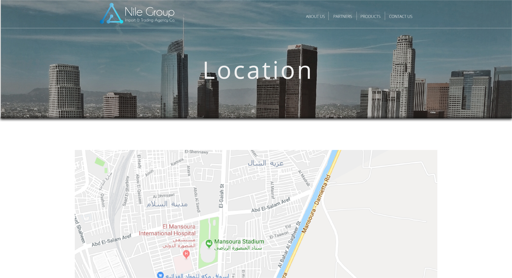
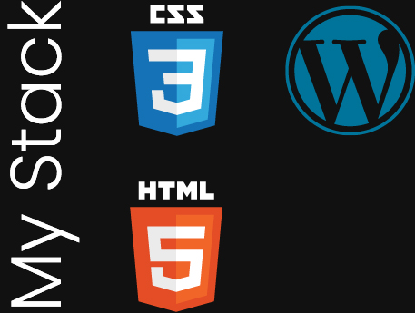

### [Nilegroup's website](https://nilegroupegy.com/)

Nile Group is a distribution and trading agency. They wanted to create a professional email and website for their B2B business when they contacted me. The website needed to display the companies they’ve been working with, and they needed this website really soon. Since this was when I was still inexperienced, I made it using Wordpress. I had absolutely no idea how to use Wordpress at the time, but I was confident I could learn it and still deliver it on time.

The hardest part was the time window I had to deliver the project on, a month. I had to learn Wordpress, create content, organize it and display it on the website within a month. This gave me a lot of experience with using wordpress, templates, and a private domain using Bluehost.

