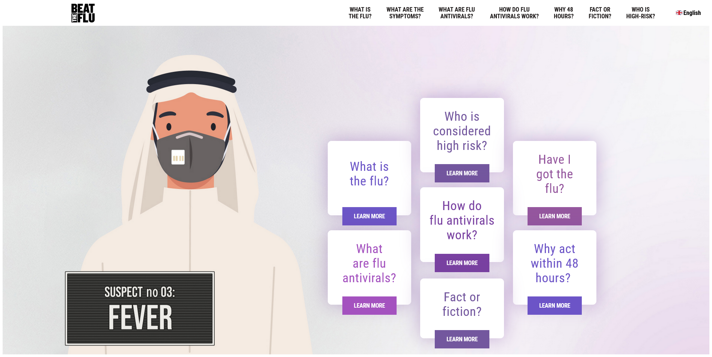

### Visit the website here: [roche beat the flu's website](https://roche-beat-theflu.web.app/)

Roche wanted to make a website to raise awareness during COVID-19, so we made a website for them that introduced it in a comparative way to the regular flu.

This project was based on pure css however it was rough we really had to get into the depths of css to create something this detailed with it.
Another challenging aspect was the Multilanguage (i18n) there were many ways to do it, like JSON objects getting called with JavaScript based on the state of the page, or serving different html pages, or using a API to store the data and serve it for us.
I learned a lot making a website with static files without a static site generator like gatsbyjs, while I used to think that there is no reason not to use gatsbyjs. I am definitely mistaken there are many scenarios that you actually don’t need to use a static site generator at all.
Firebase handles static files really well, and will serve them really fast too!

