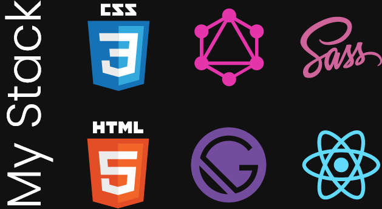

### Vist my website: [salon's website](https://salon-sassy.netlify.com/)

Dr. Mona (founder of Salon) wanted to make an app that could match people together so they could get married! Kind of like tinder right? Well no, the culture in Egypt is much different, very conservative. Let’s put it this way, it’s more like family arranged marriages. They look at each other’s degrees and assets and then they meet, if they see that the person is a good match for them personality wise. They could get married then. While this seems very strange to us, it was the case for this website, I was able to empathize and design a culture friendly (with no revealing pictures or “sexual” content or other things that would drive users away) website that would let them fill out forms and submit it to a well-known source, Dr. Mona herself and chosen colleagues.
I knew I had to build a lightning-fast website for scalability, user experience, user retention, and SEO (Search Engine Optimization), lead conversion, and to lower bounce rates. I had just learned about a new stack called JAM stack, everyone was talking about how hot it is and how fast static site generators are, so I thought it’d be perfect for what I needed. As Linda Watkins said:

> “With a website framework (like Gatsby), the website is pre-built and hosted on the edge before the user even types in a URL. This means that there are no servers involved or delays in loading a webpage. It’s just ready to go. Think of it as going to a conveyor belt sushi bar and having all the delicious sushi just waiting for you. No need to order- just pick what you want and start eating. Conveyor belt sushi for websites! “

