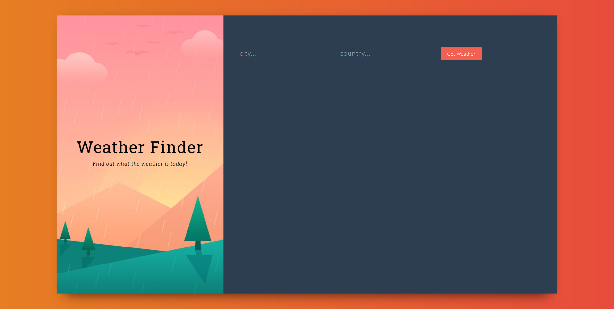
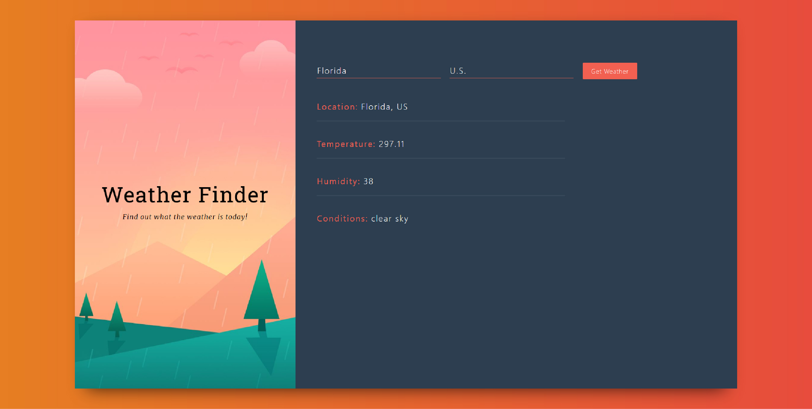

### Vist my website here [Weather App's site](https://itisraining.netlify.com/)

It's a simple app but i learned so much about API's as a new react developer this was my first build integrating weather's API to take search requests and return the API data back to my site.

You can search for any country and check the weather, temp, and other stats about the country or city you searched for, the weather API handles everything.

