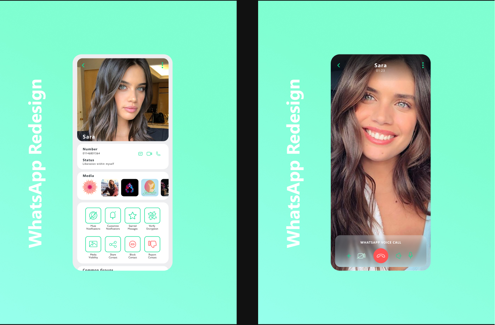
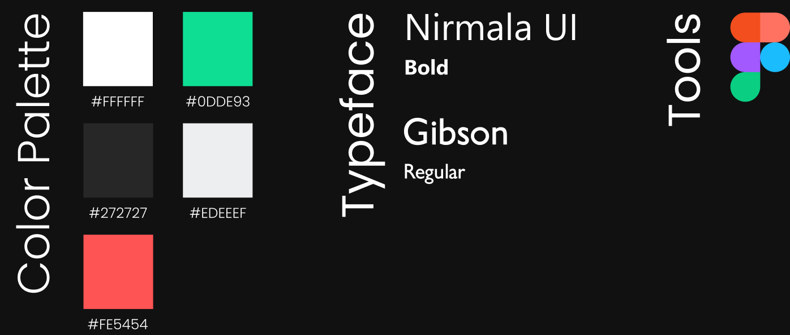

This was another personal project of mine. I didn’t really try to change the UX too much because this is Whatsapp and I could get more user data than Whatsapp itself so that I can make data driven decisions regarding the UX. Some of the UX changes I made were adding stories in the chats page to make it more visible to users so that they’re more inclined to use it. I also added an online icon externally so you could know if the user is online or not without having to open the chat, and a circular outline to indicate if they have a story and whether you’ve seen it or not.

Changes that I made to the UI were meant to give it a cleaner and modern look. The app as it is looked pretty outdated, and generally I feel like Whatsapp for whatever reason (maybe due to lack of real competition) isn’t really doing too much with their UI. I started by changing their colors, making them brighter and more vivid. I took a page out of their Facebook UI update and placed each chat box in it’s own round-cornered box. For the texting page, I made the text message boxes simpler by rounding 3 corners and leaving 1 sharp corner to pointing towards the user who sent the message (of course that’s besides the main indicator which is the green color of the text message box indicating your messages and the white for the contact’s messages). The call page in my opinion had the most outdated look, so I gave it a glass-looking panel and minimal design elements over the contact’s profile picture.

