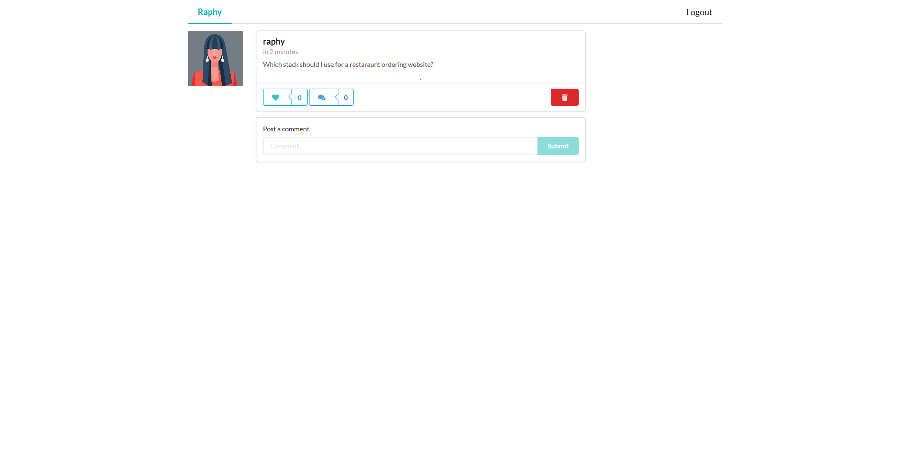
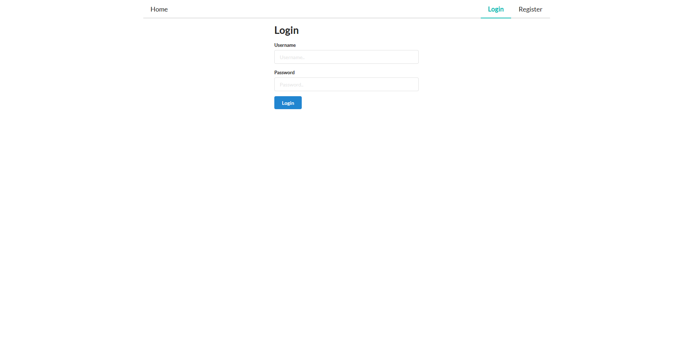

Was founded on the idea of creating a community that would share their experience with other developers, a developer would create an account and start sharing their idea, and ask what the best way of building it would be. Other developers would share their ideas of how they think the best approach and the best “stack” and their reasoning behind it.
This project was self-made to help me understand how to use a stack that I have been always interested in, and that’s the MERN (MongoDB, Express, React, and Nodejs) stack, I also used graphQL and Apollo-client to manage data in the application.
While building this I learned so much but later found out that Gatsby and the JAM stack are much faster and lighter to build. And that’s when I started learning and building Salon

