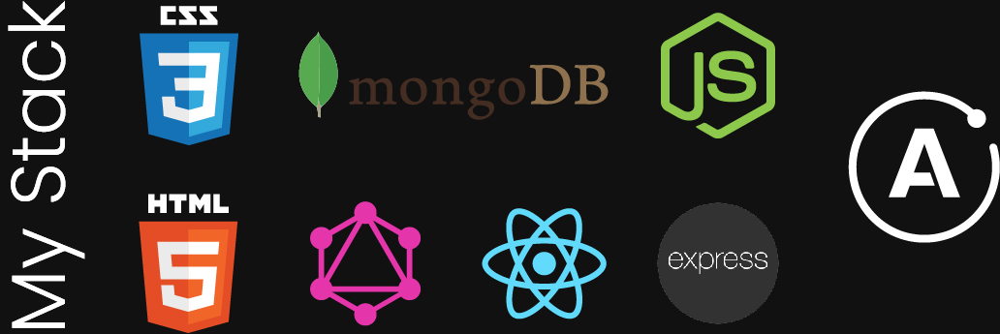

### Visit the website here: [Yves saint Laurent's website](https://everestminds-with-server.herokuapp.com/)

# App description

This is a simple online fashion store created with FERN (firebase, express, react, node).

In this web app you can:

•Create accounts

•Login

•Persist data

•View categories, collections, and shop

•Add items to cart and increase those items or remove them while viewing total price.

•Pay

•Load data while fetching.

•View on mobile (responsive)

## App process

My approach was a dry manner style for minimalism. I could have gone with full MERN project, but time was short, so I decided to go for a FERN build, leveraging the firebase authentication which does JWT and password hashing as well as disabling the accounts.

### Architecture

[simple ERD](simple-ERD.JPG)

### React

Building the front-end came after that using small modular components.

[Here](https://github.com/facebook/create-react-app) you can check out how to quickly get started with react.

## Redux for state management

Using reducers and actions you can handle the state for react, to make sure we are not state drilling through our components.

```javascript
import { createStore } from 'redux'

  <!-- /**
  * This is a reducer - a function that takes a current state value and an
  * action object describing "what happened", and returns a new state value.
  * A reducer's function signature is: (state, action) => newState
  *
  * The Redux state should contain only plain JS objects, arrays, and primitives.
  * The root state value is usually an object.  It's important that you should
  * not mutate the state object, but return a new object if the state changes.
  *
  * You can use any conditional logic you want in a reducer. In this example,
  * we use a switch statement, but it's not required.
  */ -->

function counterReducer(state = { value: 0 }, action) {
switch (action.type) {
case 'counter/incremented':
return { value: state.value + 1 }
case 'counter/decremented':
return { value: state.value - 1 }
default:
return state
}
}
```

Data persistence-

In our index.js we wrap our app with

```javascript
<PersistGate>
  <App />
</PersistGate>
```

We need to set it up on our redux/store

```javascript
const persistor = persistStore(store)
```

And config in the redux/root-reducer

```javascript
const persistConfig = {
  key: "root",
  storage,
  whitelist: ["cart", "directory", "shop"],
}
```

[Here](https://github.com/reduxjs/redux) you can check out redux.

### Firebase

set up firebase

```javascript
firebase.initializeApp(config)
```

built the firebase firestore data store.

```javascript
const userRef = firestore.doc(`users/${userAuth.uid}`)

if (!snapShot.exists) {
  const { displayName, email } = userAuth
  const createdAt = new Date()
  try {
    await userRef.set({
      displayName,
      email,
      createdAt,
      ...additionalData,
    })
  } catch (error) {
    console.log("error creating user", error.message)
  }
}

return userRef
```

[Here](https://github.com/firebase/quickstart-js) you can check out the quick start for firebase if you would like to learn more.

### DEPLOY

Finally it was a MVP and so why not deploy the project to heroku!

[deployment of the project:](https://everestminds-with-server.herokuapp.com/)
**please keep in mind this is a free server so it goes to sleep and may take 2 sec to load if it was not accessed for more than 20-30 min**

## React ES6 Hooks

looking at hooks and how clean code can be with them in my opinion I decided to switch some of my components from class to the to ES6 hooks.

[Here](https://reactjs.org/docs/hooks-intro.html) you can quickly learn about the new ES6 hooks.

## Styled components

also wanted to play around with styled components in javascript, so I made one (I do understand that there is no need for a whole library as an extra package but it's just for the sake of learning by doing).

[Here](https://github.com/styled-components/styled-components) you can get a fast understanding of what styled components are.

## PWA

I also wanted to make the app a PWA so I worked on the serviceWorker

In your index.js change

`serviceWorker.unregister();` to `serviceWorker.register();`

Is the main part then some tweeks here and there on your manifest file

[Here](https://create-react-app.dev/docs/making-a-progressive-web-app/) you can take a look at the PWA and why you should enable it with react.

## Responsive

This app was not coded mobile first, but I still wanted to make it responsive so started adding some media queries.

## Express.js

I wanted to demonstrate use of middleware using express to add payments functionality using stripe.

```javascript
//basic server
if (process.env.NODE_ENV === 'production') {
app.use(express.static(path.join(\_\_dirname, 'client/build')));

    app.get('*', function (req, res) {
      res.sendFile(path.join(__dirname, 'client/build', 'index.html'));
    });

}
```

Express is a library of middleware functions that makes it much easier to write nodejs.

[Here](https://github.com/expressjs/express) you can check out expressjs.

lastly, this project was very fun and I learned a lot building it, hope you like it.


